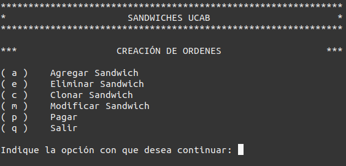
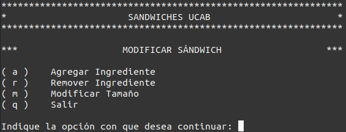
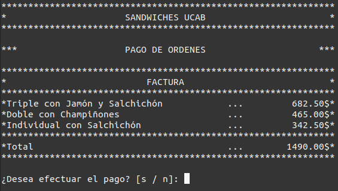

# Sandwiches UCAB


El proyecto consiste en el desarrollo de una aplicación de línea de comando, desarrollada en Python, que permite a los usuarios tomar órdenes de <strong>pedidos conformados por sandwiches</strong>.

Dentro de las <strong>principales funciones</strong> con que está dotada la aplicación resaltan el <strong>agregar sándwiches </strong>a la orden mediante la confección personalizada de los mismo, la <strong>modificación flexible</strong> de la orden y el <strong>proceso de pago</strong>.

La aplicación fue implementada bajo el enfoque de <strong>programación orientado objetos</strong> (OOP) y aplicando el patrón de diseño <strong>Modelo-Vista-Controlador</strong> (MVC)

# Requisitos para la instalación)

- Maquina con sistema operativo Windows, Linux o Mac
- <a href="https://www.python.org/" target="blank"><strong>Python</strong></a> version Version 3.8.5 o superior
- Línea de comandos para la ejecución de la aplicación

# Instalación y uso de Sandwiches UCAB

- Descarga la aplicación, clonando el contenido del repositorio
- Abrir la aplicación de línea de comando (Terminal) y dirigirse al directorio en el que se encuentra almacenada la aplicación.
- Iniciar la aplicación ejecutando el siguiente comando:

```
$ python3 PythonMiniProyecto1
```

# Preview de la apliación

## Menu de creación de ordenes



## Menu de modificación de ordenes



## Pago de ordenes



# Desarrolladores

Este producto fue desarrollado gracias al esfuerzo de las siguientes personas :

- Yeisson Venencia [@yeisson-venencia](https://github.com/yeisson-venencia) 📖
- Ezequiel Montero [@ezez8](https://github.com/ezez8) 📖
- Maximiliano Bogoljubskij [@Maxikk26](https://github.com/Maxikk26) 📖
- Roberto Carbajales [@Robertocd98](https://github.com/Robertocd98) 📖

# Contacto

Para mayor información acerca de las técnicas y metodologías de desarrollo del producto, contatar con alguno de los desarrolladores a traves de la plataforma <a href="https://github.com/" target="blank"><strong>Github</strong></a>
